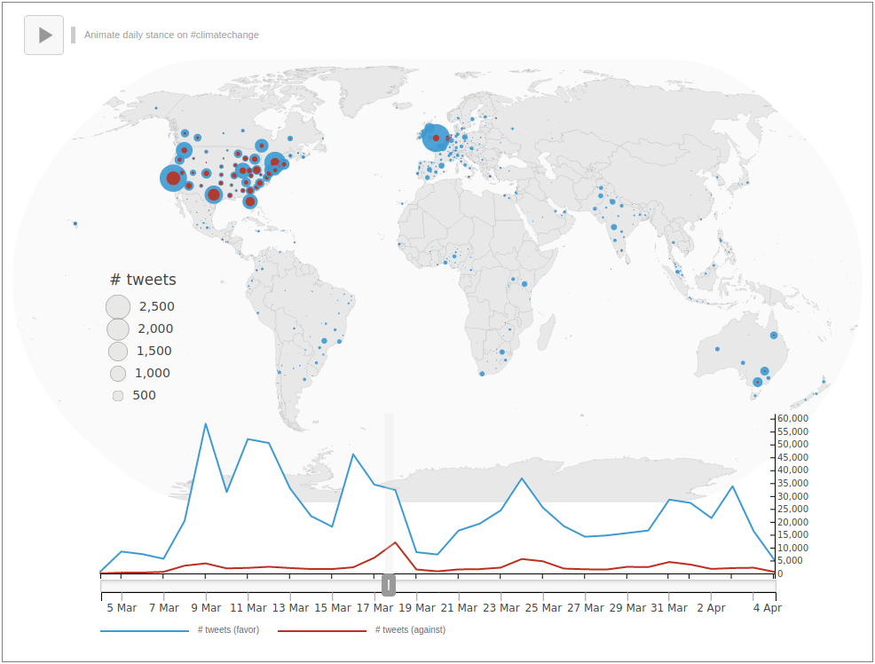

# Mapping Climate Change Stance

This is the repository for an interactive D3.js visualisation mapping the stance of tweets containing "climate change" in March/April 2020.
See `index.js` for the main D3 code, and `index.html` and the `.css` files for setup and styling.
The data (in /data) was collected and organised for this project. As the location inference turned out to be quite powerful, it is not included in this repository (I don't want to make it too easy to geolocate twitter users en masse).
The rest of the data collection process may be added at a later date.

